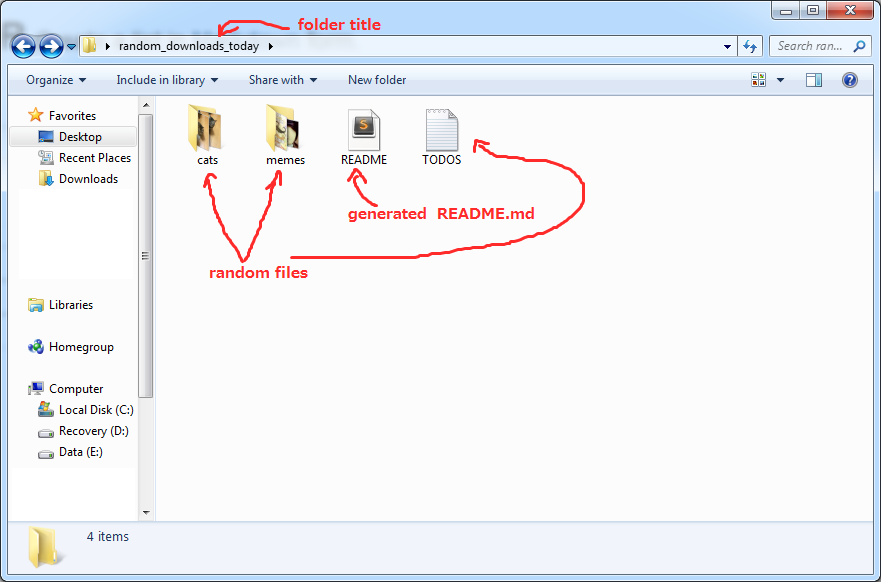
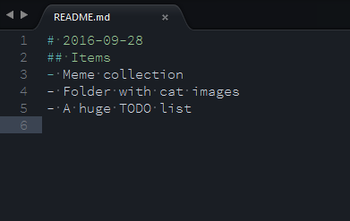
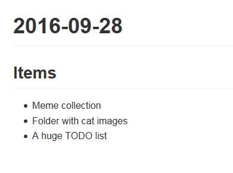

# Readmegen
A Flask app that lets me generate Markdown files that has a "title" and a "list".

# Install
- `pip install -r requirements.txt`
- `export FLASK_APP=main.py`
    - On Windows: `set FLASK_APP=main.py`
- `flask run`

# Why did you create this?
To create notes on directories that I created. I always lose track on what I put inside folders.

Here's a view of an example folder

The content of the MD file in that folder

I have a Markdown Viewer extension on my browser, so I can also view the Markdown file's neatly formatted output

# License

This software is licensed under [The MIT License](./LICENSE).